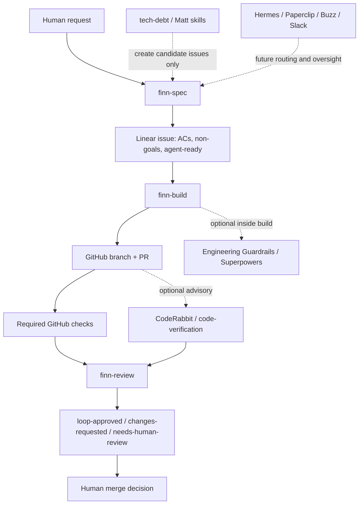

# CTO Finn-loop architecture evaluation

> Historical evaluation. Its plugin-composition recommendation was superseded
> by CTO Loop Lite V2 after real workflow testing. The active core is
> `cto-spec`, `cto-build`, `cto-review`, and the thin `cto-loop` runner, with no
> Engineering Guardrails, Superpowers, or CodeRabbit dependency. `cto-merge`
> remains an optional, explicitly human-authorized post-loop action.

Linear issue: TEAM-6

Date: 2026-07-24

## Executive recommendation

Keep the official Finn-loop as the core workflow for now: `finn-spec` creates the Linear contract, `finn-build` implements exactly one approved issue, and `finn-review` checks the PR against that issue and required GitHub checks. Do not replace this with Paperclip, Buzz, Hermes, CodeRabbit, no-mistakes, or a custom CTO loop yet.

The best next step is a layered model:

1. Core loop: official Finn-loop unchanged.
2. Build reinforcement: Engineering Guardrails and selected Superpowers invoked inside build work when the task warrants it.
3. Review reinforcement: Finn review remains the final loop verdict; CodeRabbit and code-verification can add advisory evidence.
4. Audit mode: tech-debt-skill and Matt Pocock architecture/debugging skills produce backlog candidates, not direct code changes.
5. Control plane: Linear and GitHub remain the source of truth today.
6. Future orchestration: Hermes can call Codex for bounded coding tasks; Paperclip or Buzz can be evaluated later as a higher-level agent workspace.

This is viable, but only if the system preserves a strict contract boundary: no agent starts coding from a vague chat instruction; everything buildable becomes a Linear issue with acceptance criteria, non-goals, a branch, a PR, required CI, and a human merge decision.

## Source-backed facts

- Finn-loop is a three-skill workflow for specification, build, and review. Its requirements include a GitHub repository with `origin`, a Linear workspace/team, authenticated `gh`, and at least one required GitHub status check for fully automated `loop-approved` verdicts. Without required CI, Finn-loop escalates to human review. Source: [finna/Finn-loop](https://github.com/finna/Finn-loop).
- The local `finn-build` skill requires a clean tree, claims one `agent-ready` Linear issue, implements only its acceptance criteria, preserves non-goals, opens a PR, and never merges.
- The local `finn-review` skill reviews one PR against its linked Linear issue, checks required GitHub checks, labels `loop-approved`, `loop-changes-requested`, or `needs-human-review`, and still leaves merge to a human.
- GitHub protected branch rules can require successful status checks before merging. Source: [GitHub Docs - protected branches](https://docs.github.com/repositories/configuring-branches-and-merges-in-your-repository/managing-protected-branches/about-protected-branches).
- Linear's GitHub integration links PRs and issues and syncs comments, checks, and review activity bi-directionally. Source: [Linear GitHub integration](https://linear.app/integrations/github).
- CodeRabbit reviews PRs automatically and incrementally, adding summaries, security insights, and improvement suggestions. Source: [CodeRabbit docs](https://docs.coderabbit.ai/overview/pull-request-review).
- no-mistakes is a local git proxy that runs a validation pipeline in a disposable worktree before forwarding changes and opening a PR. Source: [kunchenguid/no-mistakes](https://github.com/kunchenguid/no-mistakes).
- tech-debt-skill is a file-cited audit workflow that maps structure, churn, and debt across multiple dimensions. Source: [ksimback/tech-debt-skill](https://github.com/ksimback/tech-debt-skill).
- Matt Pocock's skills repository includes engineering workflows such as prototyping and disciplined bug diagnosis. Source: [mattpocock/skills](https://github.com/mattpocock/skills).
- i-have-adhd is an output/style skill meant to stop an agent from burying the answer and make progress easier to follow. Source: [ayghri/i-have-adhd](https://github.com/ayghri/i-have-adhd).
- Hermes documents a bundled skill that delegates coding tasks to Codex CLI for features, refactoring, PR reviews, and batch issue fixing. Source: [Hermes Agent Codex CLI skill](https://hermes-agent.nousresearch.com/docs/user-guide/skills/bundled/autonomous-ai-agents/autonomous-ai-agents-codex).
- Hermes can be connected to Linear through Composio MCP, which provides Linear issue create/update/comment operations to agents. Source: [Composio Linear for Hermes](https://composio.dev/toolkits/linear/framework/hermes-agent).
- Paperclip is an open-source Node.js server and React UI for orchestrating teams of AI agents with org charts, goals, tasks, budgets, governance, agent coordination, and audit-style management. Source: [paperclipai/paperclip](https://github.com/paperclipai/paperclip).
- Buzz is a self-hostable workspace where humans and AI agents share rooms on a relay, with an architecture including relay, auth, pub/sub, search, audit, workflow engine, and MCP agent interface. Sources: [block/buzz README](https://github.com/block/buzz/blob/main/README.md) and [block/buzz VISION](https://github.com/block/buzz/blob/main/VISION.md).
- Slack supports agent-style apps that reason, use tools, maintain context, and iterate through a response loop. Source: [Slack AI agents docs](https://docs.slack.dev/ai/).

## Classification

| Item | Classification | Recommendation | Why |
| --- | --- | --- | --- |
| Finn-loop | Core | Adopt now, unchanged | It already gives the minimum trustworthy shape: spec, build, PR, CI-aware review, human merge. |
| Linear | Control plane | Adopt now | Best current source of truth for issue contract, queue state, labels, and traceability. |
| GitHub | Control plane | Adopt now | Best current source of truth for code, branches, PRs, required checks, and human merge. |
| Engineering Guardrails | Build reinforcement and review reinforcement | Use selectively inside build/review | Adds repo-aware implementation discipline and independent verification, but should not own queue state. |
| Superpowers | Build reinforcement | Use selectively | Strong for brainstorming, TDD, debugging, plans, worktrees, and verification. Too broad to run as a blanket replacement for Finn-loop. |
| CodeRabbit | Review reinforcement | Pilot later on PRs | Useful second reviewer, but advisory only. Finn-loop labels and required CI remain the merge evidence. |
| no-mistakes | Review/build gate candidate | Defer until after Finn-loop stabilizes | Overlaps with Finn build/review and could duplicate PR creation. Promising as an optional local pre-PR gate, not as the first integration. |
| tech-debt-skill | Audit mode | Use for scheduled audits only | Good for backlog discovery. Bad fit for automatic coding loop because it can generate broad scope. |
| Matt Pocock skills | Build/audit reinforcement | Cherry-pick individual workflows | Useful patterns, especially diagnosis and specs, but importing all skills would create process conflicts. |
| i-have-adhd | Communication layer | Optional user-facing style | Helps status and handoff readability. It should not change engineering decisions. |
| Slack | Future control plane | Defer | Useful for notifications and approvals later, but Linear/GitHub already cover the core loop. |
| Hermes | Future orchestration layer | Evaluate after Finn-loop is stable | Viable route for Hermes to delegate bounded Codex work, but should call the loop rather than bypass it. |
| Paperclip | Future orchestration layer | Candidate after sandbox proof | Strong fit for agent-company governance, budgets, approvals, and dashboarding. Needs real PoC before production. |
| block/buzz | Future orchestration layer / team workspace | Candidate after sandbox proof | Strong fit for human-agent rooms and audit/event log. More experimental for this specific Finn-loop use case. |

## Can all of this be combined?

Yes, but not as one mega-skill. A mega-skill would be fragile because every tool wants to own part of the workflow: spec, planning, implementation, review, CI, PR creation, project management, and human approval. Combining them safely means assigning each tool one job and one boundary.

The viable architecture is:

The critical design rule is that only Finn-loop writes authoritative loop state today. Other tools may produce evidence, comments, candidate issues, or local checks, but they must not silently merge, rewrite acceptance criteria, bypass required CI, or change official Finn-loop labels without a clear adapter.

## Paperclip, Buzz, Hermes, or direct route?

| Option | Maturity for this use case | Integration effort | Auditability | Agent model | PoC risk |
| --- | --- | --- | --- | --- | --- |
| Direct Hermes to Codex | Medium-high | Low-medium | Medium, if all work still lands in Linear/GitHub | Hermes delegates bounded coding tasks to Codex CLI | Medium: easy to bypass Finn-loop if prompts are loose. |
| Paperclip | Medium | Medium-high | Medium-high, because governance, budgets, tasks, approvals, and tracking are central concepts | Agent team/company dashboard | Medium-high: must prove Codex/Linear/GitHub/Hermes adapters in practice. |
| Buzz | Medium-low for Finn-loop specifically | High | Potentially high, because relay/event/workflow architecture emphasizes shared trace | Human-agent rooms on a self-hostable relay | High: newer platform and may overlap with Linear/GitHub as the workspace. |
| Slack | High as communication layer, low as source of truth | Medium | Medium, if approvals are mirrored to Linear/GitHub | Agent apps inside team chat | Medium: easy for chat commands to become untracked authority. |

### Direct Hermes to Codex

Viability: high for bounded coding tasks, medium for full CTO governance.

Hermes already has a documented pattern for delegating coding to Codex CLI and can be connected to Linear through MCP. That means Hermes can plausibly say: "create or pick a Linear issue, ask Codex to build it, inspect the result, report back." This is the shortest path to a VPS-hosted CTO worker.

Risk: Hermes could become a bypass if it sends vague tasks straight to Codex without Finn-loop spec/build/review gates.

Recommendation: when Hermes is introduced, make it call the Finn-loop process, not replace it.

### Paperclip

Viability: medium-high as a future manager for agent teams.

Paperclip's model is close to the user's CTO concept: agents as workers, goals, tasks, budgets, governance, and tracking. It may be a better future dashboard for Hermes plus CTO than Slack alone.

Risks:

- It is another orchestration layer to host and secure.
- It must be tested with the user's exact tools: Codex, Linear, GitHub, Hermes.
- It can create governance duplication if Linear remains the issue source of truth.

Recommendation: evaluate Paperclip after the Finn-loop sandbox produces 3 to 5 successful PR cycles.

### Buzz

Viability: medium as a future shared workspace, lower as immediate Finn-loop replacement.

Buzz is compelling because it treats humans and agents as peers in shared rooms and includes audit/workflow concepts. The relay/event-log model may become valuable for traceability and self-hosted collaboration.

Risks:

- Newer and more experimental for the exact "Linear issue to GitHub PR to CI to review label" workflow.
- Its workspace/chat abstraction could compete with Linear as the operational source of truth.
- It may be more platform migration than the project needs right now.

Recommendation: keep Buzz in the evaluation set, but do not install or migrate until Paperclip/Hermes questions are clearer.

## Integration rules

1. Linear remains the contract source of truth. Every buildable task must have acceptance criteria and non-goals.
2. GitHub remains the code and merge source of truth. Every build creates a branch and PR.
3. Required GitHub checks are mandatory for automated `loop-approved`.
4. Humans merge. Agents can recommend, label, comment, and fix, but not merge.
5. Official Finn-loop skills stay unchanged until the sandbox proves a clear gap.
6. Build reinforcements are invoked by task type:
   - Use Engineering Guardrails for scoped implementation and verification.
   - Use Superpowers TDD for behavior changes with testable logic.
   - Use Superpowers systematic debugging for bugs and regressions.
   - Use Superpowers worktrees for risky or parallel implementation.
7. Review reinforcements are advisory:
   - CodeRabbit can comment on PRs.
   - code-verification can independently test and review.
   - Finn-review still owns the final loop label.
8. Audit skills must create issues, not direct commits.
9. Hermes, Paperclip, Buzz, and Slack may route work later, but they must route work into Finn-loop rather than around it.

## Plus variant decision

Do not create `finn-build-plus` or `finn-review-plus` yet.

Create plus variants only after evidence shows that manually invoking reinforcement skills is repeatedly useful and stable. The earliest justified variants would be:

- `finn-build-plus`: Finn build plus optional Engineering Guardrails, TDD, systematic debugging, and verification prompts.
- `finn-review-plus`: Finn review plus optional CodeRabbit evidence, code-verification, and issue-contract cross-checking.

Until then, a plus variant would be premature process sprawl. The official three-skill loop is easier to trust, debug, and compare against the original Finn-loop behavior.

## Validation plan

1. Keep the sandbox repo public and protected with at least one required check.
2. Run 3 to 5 small Finn-loop issues end to end.
3. For each issue, record:
   - issue clarity before build
   - whether build needed a reinforcement skill
   - whether review found AC or CI gaps
   - whether CodeRabbit or another reviewer found useful unique signal
   - whether the human had to intervene
4. Only after repeated value, create one new Linear issue proposing one narrow plus variant.
5. Validate the plus variant by using Finn-loop itself to build and review it.
6. Defer Paperclip/Buzz/Hermes installation until the above produces a stable minimal loop.

## Safety boundaries

- No merge automation.
- No production or VPS execution.
- No secrets in skills, docs, issues, PRs, or logs.
- No automatic installation of Paperclip, Buzz, CodeRabbit, no-mistakes, or Hermes.
- No official Finn-loop skill edits during this evaluation.
- No broad tech-debt cleanup issue without a narrowed follow-up spec.
- No Slack as command authority until identity, approval, and audit rules are designed.

## Acceptance criteria coverage

- AC-1: This document adds `docs/cto-finn-loop-architecture-evaluation.md`.
- AC-2: The evaluation covers Finn-loop, Engineering Guardrails, Superpowers, CodeRabbit, no-mistakes, tech-debt-skill, Matt Pocock skills, i-have-adhd, Linear, GitHub, Slack, Hermes, Paperclip, and block/buzz.
- AC-3: The classification table assigns each item to core, reinforcement, audit, control plane, future orchestration, or defer.
- AC-4: The Paperclip/Buzz/Hermes section compares future control-plane and orchestration options by maturity, integration effort, auditability, agent model, and PoC risk.
- AC-5: The plus variant section recommends keeping official Finn-loop unchanged for now and deferring `finn-build-plus` / `finn-review-plus`.
- AC-6: The integration rules, validation plan, and safety boundaries define how to integrate and test changes through the sandbox Finn-loop process.

## Final verdict

The CTO agent concept is viable if it is built as an operating model, not as a pile of skills. Finn-loop should be the first working spine. Linear and GitHub should be the first control plane. Reinforcement skills should be added only where they strengthen a specific phase. Hermes, Paperclip, Buzz, and Slack are real candidates, but they belong after the loop has proven itself with repeated small PRs.
